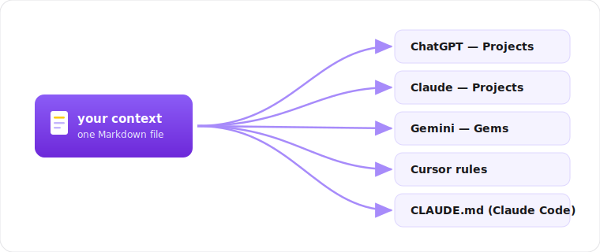

<div align="center">

# ai-context-kit

Build a reusable **context file about you and your company**, once — then drop it into any AI tool so every answer is sharper and on-brand. Two Claude Code skills that interview you, plus plain Markdown templates if you don't use Claude Code.

[](LICENSE)




</div>

## Why

An AI assistant is only as good as the context you give it. Most people retype the same facts — who they are, what the company does, who the clients are — into every new chat. Then the answers come back generic, because the model is guessing.

This kit helps you write that context down **once**, as clean Markdown, and reuse it everywhere. It's the boring foundation that makes everything else (proposals, content, client replies, code) come out in your voice instead of a stranger's.

Two pieces, because they change at different speeds:

- **personal-context** — who *you* are: role, background, how you work, how you want AI to help.
- **company-context** — what the *company* is: offer, clients, personas, positioning, voice, common questions.

## Two ways to build it

**With [Claude Code](https://claude.com/claude-code) (guided interview):** install a skill, run it, answer a short set of questions. The skill probes gaps, suggests what's missing, and writes the file for you.

```bash
git clone https://github.com/nocodework/ai-context-kit
cp -r ai-context-kit/skills/personal-context ~/.claude/skills/
cp -r ai-context-kit/skills/company-context  ~/.claude/skills/
```

Then in Claude Code: *"build my personal context"* or *"build our company context"*. Output lands as `personal-context.md` / `company-context.md`.

**Without Claude Code (fill a template):** copy a template and write the answers yourself.

```bash
curl -O https://raw.githubusercontent.com/nocodework/ai-context-kit/main/templates/company-context.template.md
```

See [`examples/`](examples) for filled-in samples to copy the shape from.

## Use your context in any AI tool

You wrote one Markdown file. Here's where to put it so the AI actually uses it. (Menu names change over time; the idea is always "instructions / knowledge / project files / rules".)

**Universal (works everywhere):** paste the file's contents at the start of a chat, or attach the `.md` as a file. Simple, always works.

**ChatGPT**
- *Projects:* create a Project → open it → **Instructions** and paste the context, or add the `.md` as a project **file**. Every chat inside that project then uses it.
- *Custom GPT:* Configure → **Instructions** (paste) or **Knowledge** (upload the `.md`).

**Claude**
- *Projects:* create a Project → **Project knowledge** → add the `.md` (or paste into the project's custom instructions). Shared by every chat in the project.
- *Claude Code:* put it in **`CLAUDE.md`** at your repo root (or `~/.claude/CLAUDE.md` for all projects). It's loaded automatically every session — no pasting.

**Gemini**
- *Gems:* create a Gem → paste the context into the Gem's **instructions**. Or attach the `.md` file in a normal chat.

**Cursor / AI IDEs**
- Add it to **`.cursor/rules`** (or `.cursorrules`) / your editor's project-rules so the in-editor AI always has it.

**Keep it alive:** store the file in a repo or a note, update it as things change, and re-paste / re-upload the new version. A stale context is worse than none.

## What each context captures

**personal-context** — identity and role, short background and expertise, what you do day to day, how you like to work and decide, your communication style and voice, your goals, and how you want AI to help (formats to use, things to always/never do).

**company-context** — what the company does in one line, the offer and what makes it different, your ideal customer and real client examples, key personas (who buys, who uses, their pains), positioning and messaging, tone of voice (words to use/avoid), the team, and the questions clients ask most often with your answers.

Full field lists live in [`templates/`](templates).

## Contributing

Issues and PRs welcome — see [CONTRIBUTING.md](CONTRIBUTING.md). The output is plain Markdown and the skills are plain instructions; nothing to build.

## License

[MIT](LICENSE), by [NoCodeWork](https://nocodework.io). Use it for anything.

---

<div align="center">
Built by <a href="https://nocodework.io">NoCodeWork</a>, where we make automation and AI apps for companies. Context beats tools.
</div>
