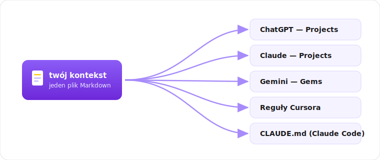
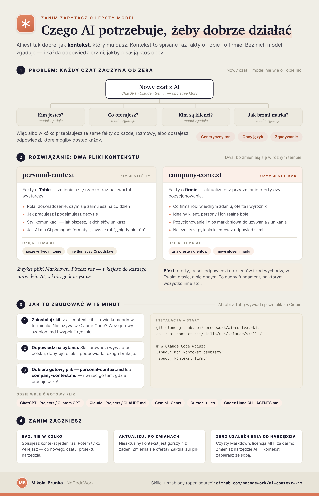

<div align="center">

[English](README.md) · **Polski**

# ai-context-kit

Zbuduj raz **plik kontekstu o sobie i o firmie** — a potem wrzuć go do dowolnego narzędzia AI, żeby każda odpowiedź była celniejsza i w Twoim stylu. Dwa skille do Claude Code, które przeprowadzają wywiad, plus zwykłe szablony Markdown, jeśli nie używasz Claude Code.

[](LICENSE)




</div>

## Po co

Asystent AI jest tak dobry, jak kontekst, który mu dasz. Większość ludzi w kółko przepisuje te same fakty — kim są, czym zajmuje się firma, kim są klienci — do każdego nowego czatu. A potem odpowiedzi są generyczne, bo model zgaduje.

Ten zestaw pomaga spisać ten kontekst **raz**, jako czysty Markdown, i używać go wszędzie. To nudny fundament, dzięki któremu wszystko inne (oferty, treści, odpowiedzi dla klientów, kod) wychodzi w Twoim głosie, a nie obcym.

Dwa elementy, bo zmieniają się w różnym tempie:

- **personal-context** — kim jesteś *Ty*: rola, doświadczenie, jak pracujesz, jak AI ma Ci pomagać.
- **company-context** — czym jest *firma*: oferta, klienci, persony, pozycjonowanie, głos marki, częste pytania.

## Dwa sposoby na zbudowanie

**Z [Claude Code](https://claude.com/claude-code) (wywiad):** zainstaluj skill, odpal, odpowiedz na kilka pytań. Skill dopytuje o luki, podpowiada, czego brakuje, i pisze plik za Ciebie.

```bash
git clone https://github.com/nocodework/ai-context-kit
mkdir -p ~/.claude/skills
cp -r ai-context-kit/skills/personal-context ~/.claude/skills/
cp -r ai-context-kit/skills/company-context  ~/.claude/skills/
```

Potem w Claude Code: *„zbuduj mój kontekst osobisty”* albo *„zbuduj kontekst firmy”* (skille działają po polsku — pytają i piszą w Twoim języku). Wynik: `personal-context.md` / `company-context.md` w katalogu, w którym uruchomiłeś Claude Code. Po aktualizacji repo skopiuj skille ponownie tym samym sposobem.

**Bez Claude Code (wypełnij szablon):** skopiuj polski szablon i wpisz odpowiedzi sam.

```bash
curl -O https://raw.githubusercontent.com/nocodework/ai-context-kit/main/templates/company-context.template.pl.md
```

W [`examples/`](examples) są wypełnione przykłady (po angielsku i polsku) — można skopiować strukturę.

## Użyj kontekstu w każdym narzędziu AI

Masz jeden plik Markdown. Oto gdzie go wstawić, żeby AI faktycznie go używało. (Nazwy menu się zmieniają; idea zawsze ta sama — „instrukcje / wiedza / pliki projektu / reguły”.)

**Uniwersalnie (działa wszędzie):** wklej treść pliku na początku czatu albo załącz plik `.md`. Proste, zawsze działa.

**ChatGPT**
- *Projects:* utwórz Projekt → otwórz → **Instructions** i wklej kontekst, albo dodaj `.md` jako **plik** projektu. Każdy czat w tym projekcie go używa.
- *Custom GPT:* Configure → **Instructions** (wklej) lub **Knowledge** (wgraj `.md`). Jeśli GPT jest udostępniony publicznie, traktuj Knowledge jako jawne — użytkownicy potrafią wyciągnąć te pliki, więc nazwy klientów i know-how sprzedażowe trzymaj w prywatnych Projects.

**Claude**
- *Projects:* utwórz Projekt → **Project knowledge** → dodaj `.md` (albo wklej w instrukcje projektu). Współdzielony przez wszystkie czaty w projekcie.
- *Claude Code:* wrzuć do **`CLAUDE.md`** w katalogu repo (albo `~/.claude/CLAUDE.md` dla wszystkich projektów). Ładuje się automatycznie co sesję — bez wklejania.

**Gemini**
- *Gems:* utwórz Gem → wklej kontekst w **instrukcje** Gema. Albo załącz `.md` w zwykłym czacie.

**Cursor / edytory AI**
- Zapisz jako **`.cursor/rules/context.mdc`** z `alwaysApply: true` we frontmatterze — treść Markdown zostaje bez zmian. (`.cursorrules` wciąż działa, ale to podejście legacy.)

**Agentowe CLI (Codex, Gemini CLI, GitHub Copilot)**
- Ten sam plik, inna nazwa: **`AGENTS.md`** w katalogu głównym repo (czytany przez Codexa, Cursora i coraz więcej narzędzi), **`GEMINI.md`** dla Gemini CLI, **`.github/copilot-instructions.md`** dla GitHub Copilot.

**Utrzymuj aktualność:** trzymaj plik w repo lub notatce, aktualizuj przy zmianach i wklejaj/wgrywaj nową wersję. Nieaktualny kontekst jest gorszy niż żaden.

## Co zawiera każdy kontekst

**personal-context** — tożsamość i rola, krótkie tło i ekspertyza, co robisz na co dzień, jak lubisz pracować i decydować, styl komunikacji i głos, cele oraz jak AI ma Ci pomagać (formaty odpowiedzi, co robić zawsze, a czego nigdy).

**company-context** — co firma robi w jednym zdaniu, oferta i wyróżniki, idealny klient i realne przykłady, kluczowe persony (kto kupuje, kto używa, ich bóle), pozycjonowanie i komunikacja, głos marki (słowa do używania/unikania), zespół oraz najczęstsze pytania klientów z odpowiedziami.

Pełne listy pól: [`templates/`](templates).

## Całość w jednym obrazku

<div align="center">

</div>

## Współpraca

Issues i PR-y mile widziane — patrz [CONTRIBUTING.md](CONTRIBUTING.md) i [roadmapa](ROADMAP.md). Pierwszy raz? Jest kilka [good first issues](https://github.com/nocodework/ai-context-kit/labels/good%20first%20issue) — przetłumaczenie szablonu albo dodanie nowego typu kontekstu (produkt, projekt, głos marki) to dobry start. Wynik to czysty Markdown, a skille to zwykłe instrukcje; nie ma nic do budowania. Bądźmy w porządku: [Code of Conduct](CODE_OF_CONDUCT.md).

## Licencja

[MIT](LICENSE), [NoCodeWork](https://nocodework.io). Używaj do czego chcesz.

---

<div align="center">
Zrobione przez <a href="https://nocodework.io">NoCodeWork</a> — robimy automatyzacje i aplikacje AI dla firm. Kontekst bije narzędzia.
</div>
