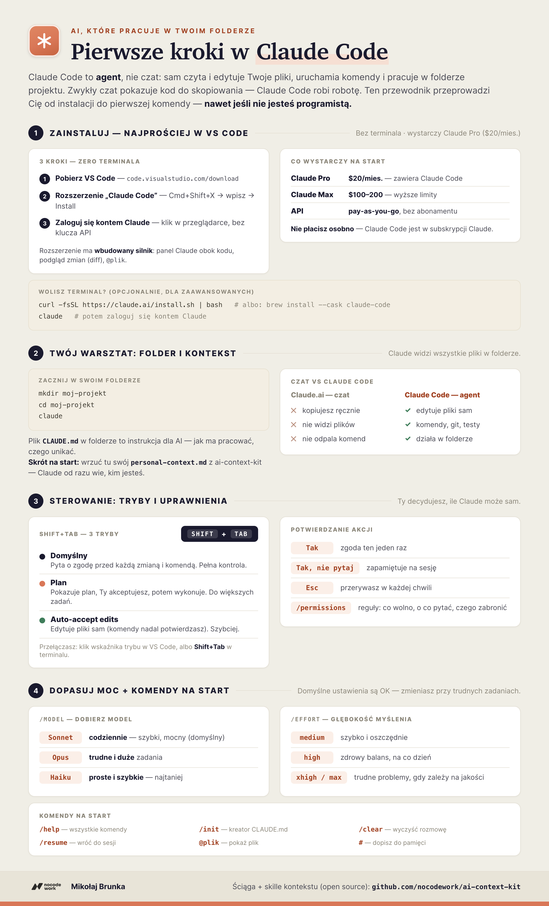

# Pierwsze kroki w Claude Code

> Krótki przewodnik po polsku: od instalacji do pierwszej komendy — **nawet jeśli nie jesteś programistą.**
> Skille z tego repo (`personal-context`, `company-context`) działają właśnie w Claude Code, więc zacznij tutaj.

**Claude Code to agent, nie czat.** Zwykły czat na [claude.ai](https://claude.ai) pokazuje kod i tekst, który kopiujesz ręcznie. Claude Code **sam czyta i edytuje Twoje pliki, uruchamia komendy i pracuje w folderze Twojego projektu** — od poprawki literówki po cały projekt.



---

## 1. Ile to kosztuje — co wystarczy na start

Nie płacisz za Claude Code osobno. Jest w subskrypcji Claude, z której (być może) już korzystasz w czacie.

| Plan | Cena | Dla kogo |
|---|---|---|
| **Claude Pro** | **$20 / mies.** | **Start — w zupełności wystarczy.** Zawiera Claude Code. |
| Claude Max | $100–200 / mies. | Wyższe limity przy intensywnej, codziennej pracy |
| API (pay-as-you-go) | za zużycie | Płacisz za tokeny, bez abonamentu |

🔗 Aktualne plany i limity: **[claude.com/pricing](https://claude.com/pricing)**

---

## 2. Najprościej: VS Code + rozszerzenie (bez terminala)

Nie musisz dotykać terminala. Rozszerzenie Claude Code do VS Code **ma wbudowaną własną kopię silnika** — wystarczą trzy kroki:

1. **Pobierz i zainstaluj VS Code** (darmowy edytor): [code.visualstudio.com/download](https://code.visualstudio.com/download)
2. **Zainstaluj rozszerzenie „Claude Code"** — w VS Code naciśnij `Cmd+Shift+X` (Windows/Linux: `Ctrl+Shift+X`), wpisz „Claude Code" i kliknij **Install**. Albo jednym kliknięciem: [zainstaluj rozszerzenie](vscode:extension/anthropic.claude-code).
3. **Zaloguj się** — przy pierwszym otwarciu panelu kliknij **Sign in** i dokończ w przeglądarce. Wystarczy dowolna płatna subskrypcja Claude (Pro / Max / Team), bez klucza API.

Klikasz ikonę **Spark**, a panel Claude otwiera się obok kodu: **pliki po lewej, podgląd zmian (diff)** i `@plik`.

🔗 [Rozszerzenie do VS Code](https://code.claude.com/docs/en/vs-code) · [Plugin do JetBrains](https://code.claude.com/docs/en/jetbrains)

---

## 3. Wolisz terminal? (opcjonalnie)

Jeśli wolisz wiersz poleceń — albo potrzebujesz funkcji dostępnych tylko w CLI — zainstaluj Claude Code osobno:

```bash
# Rekomendowane (z auto-aktualizacją)
curl -fsSL https://claude.ai/install.sh | bash

# albo przez Homebrew
brew install --cask claude-code

# albo przez npm (wymaga Node.js 22+)
npm install -g @anthropic-ai/claude-code
```

Potem wpisz **`claude`** w folderze projektu i zaloguj się kontem Claude. Komenda **`/login`** zmienia konto.

🔗 [Quickstart](https://code.claude.com/docs/en/quickstart) · [Instalacja i konfiguracja](https://code.claude.com/docs/en/setup)

---

## 4. Twój warsztat: folder projektu i kontekst

Claude Code pracuje w folderze. Zacznij od utworzenia własnego:

```bash
mkdir moj-projekt
cd moj-projekt
claude
```

Claude widzi **wszystkie pliki w tym folderze**. Dwie rzeczy warto tu położyć:

- **`CLAUDE.md`** — instrukcja dla AI: jak ma z Tobą pracować, czego unikać, jakie są konwencje. Kreator: wpisz **`/init`**.
- **Twój `personal-context.md`** z tego repo (ai-context-kit) — wtedy Claude od razu wie, kim jesteś i jak piszesz. To najprostszy sposób, żeby odpowiedzi brzmiały jak Ty.

🔗 [Pamięć i CLAUDE.md](https://code.claude.com/docs/en/memory)

---

## 5. Tryby pracy — jeden skrót, trzy tryby

W panelu VS Code klikasz **wskaźnik trybu** na dole prompt boxa; w terminalu przełączasz je skrótem **`Shift + Tab`**:

| Tryb | Co robi | Dla kogo |
|---|---|---|
| **Domyślny** | Pyta o zgodę przed każdą zmianą pliku i komendą | Pełna kontrola |
| **Plan** | Najpierw pokazuje plan działania — Ty akceptujesz, potem wykonuje | Większe zadania |
| **Auto-accept edits** | Edytuje pliki sam (komendy nadal potwierdzasz) | Gdy ufasz i chcesz szybciej |

---

## 6. Ty masz kontrolę — potwierdzanie akcji

Zanim Claude edytuje plik albo uruchomi komendę, **pyta o zgodę**:

- **`Tak`** — zgoda ten jeden raz
- **`Tak, nie pytaj ponownie`** — zapamiętuje na tę sesję (mniej klikania)
- **`Esc`** — przerywasz Claude'a w każdej chwili
- **`/permissions`** — ustawiasz reguły: co wolno, o co pytać, czego zabronić

🔗 [Uprawnienia](https://code.claude.com/docs/en/permissions)

---

## 7. Wybór modelu — `/model`

Dobierasz model do zadania (szybkość, moc, koszt):

- **Sonnet** — codzienna praca, szybki i mocny (domyślny wybór)
- **Opus** — trudne, duże, skomplikowane zadania
- **Haiku** — proste i szybkie, najtaniej

Wpisz **`/model`** i wybierz z listy — albo od razu **`/model opus`**.

## 8. Głębokość myślenia — `/effort`

Ustawiasz, ile AI ma „myśleć" nad odpowiedzią. Więcej = mądrzej, ale drożej i wolniej.

- **`medium`** — szybko i oszczędnie, do prostych zadań
- **`high`** — zdrowy balans na co dzień
- **`xhigh` / `max`** — trudne problemy, gdy zależy Ci na jakości

Na start **nie ruszaj** — domyślne ustawienie jest OK. Podnosisz, gdy zadanie jest naprawdę trudne.

🔗 [Konfiguracja modelu i effort](https://code.claude.com/docs/en/model-config)

---

## 9. Komendy na dobry start

| Komenda | Co robi |
|---|---|
| `/help` | wszystkie dostępne komendy |
| `/init` | kreator pliku `CLAUDE.md` |
| `/clear` | wyczyść rozmowę, zacznij świeżo |
| `/resume` | wróć do poprzedniej sesji |
| `@plik` | pokaż Claude'owi konkretny plik |
| `#` | dopisz coś do pamięci na stałe |

---

## Co dalej

Masz Claude Code. Teraz daj mu **kontekst**, żeby odpowiedzi brzmiały jak Ty, a nie jak „asystent AI":

```
„zbuduj mój kontekst osobisty"
„zbuduj kontekst firmy"
```

Te dwa skille (`personal-context` i `company-context`) przeprowadzą z Tobą wywiad po polsku i napiszą gotowe pliki. Instalacja i szczegóły: **[README repo](../README.pl.md)**.

> **Kontekst bije narzędzia.**

---

*Przewodnik: [Mikołaj Brunka](https://github.com/nocodework) · NoCodeWork. Materiał edukacyjny — stan na lipiec 2026, sprawdzaj oficjalną [dokumentację Claude Code](https://code.claude.com/docs) po aktualne szczegóły.*
